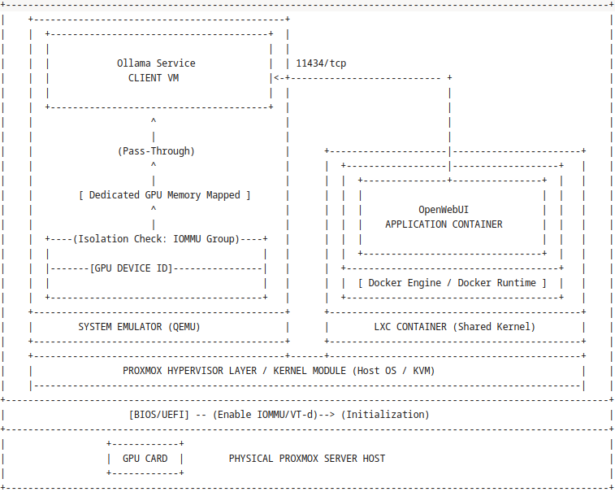

# Ollama with NVIDIA GPU in Proxmox VM and LXC container

The setup has two components:

- Client VM with Ollama for AI model serving [--->](#ollama_vm)

- LXC container with OpenWebUI for management and user access [--->](#openwebui_lxc)




<a id="ollama_vm"></a>
# Run VM with Ollama using GPU Passthrough

Prerequisites:

- IOMMU enabled in the Proxmox server BIOS
- GPU card(s) supported by Ollama

**Note:** *The ASUS Z9PA-D8 motherboard is not listed as supporting IOMMU, but the setup still worked*  `¯\_(ツ)_/¯`

## Configure GPU Passthrough in Proxmox

1. Enable IOMMU in GRUB:
    
    ```bash
    ## Open GRUP Configuration File
    nano /etc/default/grub
    
    ## Add or alter the CMDLINE line to include the following
    GRUB_CMDLINE_LINUX_DEFAULT="quiet iommu=on iommu=pt pcie_acs_override=downstream,multifunction"
    
    ## Save the file then update GRUB
    update-grub
    
    ## Don't reboot yet. Wait after adding VFIO Kernel Modules
    ```

2. Load the VFIO Kernel Modules

    If the GPU drivers are already installed on the Proxmox server, you'll need to blacklist then to keep Proxmox from using them:
    
    ```bash
    ## Create the blacklist file
    nano /etc/modprobe.d/blacklist.conf
    
    ## Add relevant drivers
    ## For AMD
    blacklist radeon
    ## For NVIDIA
    blacklist nouveau
    blacklist nvidia
    blacklist nvidiafb
    blacklist rivafb
    ```
    
    Add the VFIO modules
    
    ```bash
    ## Open the modules file
    nano /etc/modules
    
    ## Add all four lines below
    vfio
    vfio_iommu_type1
    vfio_pci
    vfio_virqfd
    
    ## Save the file then reboot to update both GRUB and kernel modules
    ```

3. Verify IOMMU configuration status
    
    ```bash
    dmesg | grep -e IOMMU -e DMAR
    [    0.017209] ACPI: DMAR 0x000000007C9F6300 0000E0 (v01 A M I  OEMDMAR  00000001 INTL 00000001)
    [    0.017259] ACPI: Reserving DMAR table memory at [mem 0x7c9f6300-0x7c9f63df]
    [    0.207585] DMAR: IOMMU enabled
    [    0.207613] DMAR: IOMMU enabled
    [    0.536593] DMAR: Host address width 46
    [    0.536595] DMAR: DRHD base: 0x000000fbffe000 flags: 0x0
    [    0.536616] DMAR: dmar0: reg_base_addr fbffe000 ver 1:0 cap d2078c106f0466 ecap f020da
    [    0.536621] DMAR: DRHD base: 0x000000cfffc000 flags: 0x1
    [    0.536627] DMAR: dmar1: reg_base_addr cfffc000 ver 1:0 cap d2078c106f0466 ecap f020da
    [    0.536630] DMAR: RMRR base: 0x0000007e96b000 end: 0x0000007e981fff
    [    0.536634] DMAR: RHSA base: 0x000000fbffe000 proximity domain: 0x1
    [    0.536636] DMAR: RHSA base: 0x000000cfffc000 proximity domain: 0x0
    [    0.536640] DMAR-IR: IOAPIC id 3 under DRHD base  0xfbffe000 IOMMU 0
    [    0.536643] DMAR-IR: IOAPIC id 0 under DRHD base  0xcfffc000 IOMMU 1
    [    0.536645] DMAR-IR: IOAPIC id 2 under DRHD base  0xcfffc000 IOMMU 1
    
    ```

4. Identify GPU and additional functions 
    
    ```bash
    lspci -nn | grep -i nvidia
    03:00.0 VGA compatible controller [0300]: NVIDIA Corporation TU116 [GeForce GTX 1650 SUPER] [10de:2187] (rev a1)
    03:00.1 Audio device [0403]: NVIDIA Corporation TU116 High Definition Audio Controller [10de:1aeb] (rev a1)
    03:00.2 USB controller [0c03]: NVIDIA Corporation TU116 USB 3.1 Host Controller [10de:1aec] (rev a1)
    03:00.3 Serial bus controller [0c80]: NVIDIA Corporation TU116 USB Type-C UCSI Controller [10de:1aed] (rev a1)
    
    ## Take note the addresses and check all devices are in the same IOMMU group and it's not shared with other devices
    find /sys/kernel/iommu_groups/ -type l
    
    ## Another way to find the IOMMU group
    lspci -v
    .
    .
    .
    03:00.3 Serial bus controller: NVIDIA Corporation TU116 USB Type-C UCSI Controller (rev a1)
        Subsystem: Micro-Star International Co., Ltd. [MSI] Device 3850
        Flags: bus master, fast devsel, latency 0, IRQ 65, NUMA node 0, IOMMU group 24
        Memory at c3084000 (32-bit, non-prefetchable) [size=4K]
        Capabilities: [68] MSI: Enable+ Count=1/1 Maskable- 64bit+
        Capabilities: [78] Express Endpoint, IntMsgNum 0
        Capabilities: [b4] Power Management version 3
        Capabilities: [100] Advanced Error Reporting
        Kernel driver in use: vfio-pci
        Kernel modules: i2c_nvidia_gpu
    ```


## Create Ollama VM

1. Create a Linux VM in Proxmox. VM created with the following settings:

    - BIOS: `Default(SeaBIOS)`  <-- Since the VM will not use the GPU as the main display adapter
    - Processors: `1 CPU, 8 cores`
    - Memory: `16GB`
    - Hard Disk: `100GB`
    - Display: `Default`
    - Network: `Default`

2. Add the PCI passthrough device
   - In Proxmox, go to *Datacenter > Node > VM > Hardware*
   - Click *Add*, the select `PCI Device` from the dropdown
   - In the *Add: PCI Device* dialog, select `Raw Device`
   - In the *Device* dropdown, look for the GPU ID and select it.
   - Check `All Functions` 
   - Click on *Add*

3. Start the VM and install the operating system
   
   - Note: *Pop_OS! failed, installed Kubuntu*

4. Install NVIDIA drivers
   
   - Some installations may detect and install the NVIDIA drivers during install process

    ```bash
    ## Determine your NVIDIA graphics card model and the recommended driver
    ubuntu-drivers devices

    == /sys/devices/pci0000:00/0000:00:10.0 ==
    modalias : pci:v000010DEd00002187sv00001462sd00003850bc03sc00i00
    vendor   : NVIDIA Corporation
    model    : TU116 [GeForce GTX 1650 SUPER]
    driver   : nvidia-driver-590-open - distro non-free
    driver   : nvidia-driver-590-server-open - distro non-free
    driver   : nvidia-driver-535-open - distro non-free
    driver   : nvidia-driver-535-server-open - distro non-free
    driver   : nvidia-driver-580-server - distro non-free
    driver   : nvidia-driver-570 - distro non-free
    driver   : nvidia-driver-570-server - distro non-free
    driver   : nvidia-driver-580 - distro non-free
    driver   : nvidia-driver-580-server-open - distro non-free
    driver   : nvidia-driver-470 - distro non-free
    driver   : nvidia-driver-570-server-open - distro non-free
    driver   : nvidia-driver-580-open - distro non-free recommended
    driver   : nvidia-driver-590-server - distro non-free
    driver   : nvidia-driver-535 - distro non-free
    driver   : nvidia-driver-470-server - distro non-free
    driver   : nvidia-driver-590 - distro non-free
    driver   : nvidia-driver-570-open - distro non-free
    driver   : nvidia-driver-535-server - distro non-free
    driver   : xserver-xorg-video-nouveau - distro free builtin
    
    ## Install NVIDIA driver
    sudo apt update
    sudo apt install -y nvidia-driver-590
    
    ## Reboot
    sudo reboot
    
    ## Verify driver installation
    nvidia-smi
        
    +-----------------------------------------------------------------------------------------+
    | NVIDIA-SMI 590.48.01              Driver Version: 590.48.01      CUDA Version: 13.1     |
    +-----------------------------------------+------------------------+----------------------+
    | GPU  Name                 Persistence-M | Bus-Id          Disp.A | Volatile Uncorr. ECC |
    | Fan  Temp   Perf          Pwr:Usage/Cap |           Memory-Usage | GPU-Util  Compute M. |
    |                                         |                        |               MIG M. |
    |=========================================+========================+======================|
    |   0  NVIDIA GeForce GTX 1650 ...    Off |   00000000:00:10.0 Off |                  N/A |
    |  0%   38C    P8              5W /  100W |      14MiB /   4096MiB |      0%      Default |
    |                                         |                        |                  N/A |
    +-----------------------------------------+------------------------+----------------------+
    
    +-----------------------------------------------------------------------------------------+
    | Processes:                                                                              |
    |  GPU   GI   CI              PID   Type   Process name                        GPU Memory |
    |        ID   ID                                                               Usage      |
    |=========================================================================================|
    |    0   N/A  N/A            1177      G   /usr/lib/xorg/Xorg                        4MiB |
    +-----------------------------------------------------------------------------------------+
    ```

5. Install Ollama
   
    ```bash
    ## From Ollama official website
    curl -fsSL https://ollama.com/install.sh | sh

    ## Test installation
    ollama run llama3

    >>> Hello
    Hello! It's nice to meet you. Is there something I can help you with, or would you like to chat?
    
    >>> 'Send a message (/? for help)'
    
    >>> /bye
    ```

6. Make the Ollama API available to LAN clients

    By default Ollama only listens on `127.0.0.1:11434`. To make it available for network clients to connect in, you need to modify the `OLLAMA_HOST` environment variable of the service.

    ```bash
    ## Edit the Ollama service file
    sudo vi /etc/systemd/system/ollama.service
    
    ## Modify the following line
    [Service]
    Environment="OLLAMA_HOST=0.0.0.0:11434"
    
    ## Restart the service
    sudo systemctl daemon-reload
    sudo systemctl restart ollama
    
    ## Verify the service is listening on all interfaces
    ss -tulnp | grep 11434
    tcp   LISTEN 0      4096               *:11434            *:*  
    
    ## Allow connections to Ollama API port (if needed)
    sudo ufw allow 11434/tcp
    ```


<a id="openwebui_lxc"></a>
# Run OpenWebUI in a Proxmox LXC Container

To run Open WebUI effectively, the following minimum specifications are recommended:

| Component  | Minimum Requirement                                  |
| ---------- | ---------------------------------------------------- |
| CPU        | 1 core (Intel/AMD with AVX512 support recommended)   |
| RAM        | 1 GB (16 GB recommended for better performance)      |
| Disk Space | 10 GB (50 GB recommended for Docker and model files) |


## Setting Up the LXC Container on Proxmox

1. Create a new LXC container  in Proxmox. 
   
    The container was created with the following specifications:

    - General tab:
       - Hostname: `<Hostname>`
       - Nesting: `Checked` 
    - Template tab:
       - Template: `debian-13-standard` 
    - Disks tab:
       - Disk Size: `32GB` 
    - CPU tab:
       - Cores: `2` 
    - Memory tab:
       - Memory: `2048MB` 
       - Swap: `1024MB` 
    - Network tab:
       - IPv4: `Static` 
       - IPv4/CIDR: `<IP Address>` 
       - Gateway (IPv4): `<Gateway>` 
    - DNS tab:
       - Leave defaults 

2. Install Docker
   
    Follow the official installation guide for Debian: [Docker Installation for Debian](https://docs.docker.com/desktop/setup/install/linux/debian/)

    Open a shell to the LXC Container:

    ```bash
    ## If not using GNOME, you must install gnome-terminal
    apt install gnome-terminal

    ## Install using the `apt` repository
    ## Add Official GPG key
    apt update
    apt install ca-certificates curl
    install -m 0755 -d /etc/apt/keyrings
    curl -fsSL https://download.docker.com/linux/debian/gpg -o /etc/apt/keyrings/docker.asc
    chmod a+r /etc/apt/keyrings/docker.asc
    
    ## Add the repository to Apt sources
    tee /etc/apt/sources.list.d/docker.sources <<EOF
    Types: deb
    URIs: https://download.docker.com/linux/debian
    Suites: $(. /etc/os-release && echo "$VERSION_CODENAME")
    Components: stable
    Architectures: $(dpkg --print-architecture)
    Signed-By: /etc/apt/keyrings/docker.asc
    EOF
    
    apt update

    ## Install the Docker packages
    apt install docker-ce docker-ce-cli containerd.io docker-buildx-plugin docker-compose-plugin

    ## Verify docker is running
    systemctl status docker
    ```


## Running OpenWebUI Container

1. Start OpenWebUI on Docker
   
    ```bash
    docker run -d -p 8080:8080 --add-host=host.docker.internal:host-gateway -e OLLAMA_BASE_URL=http://<Ollama host URL or IP address>:11434 -v open-webui:/app/backend/data --name open-webui --restart always ghcr.io/open-webui/open-webui:main
    ```

2. Access OpenWebUI in your browser
   
    `http://<container’s IP>:8080`

    Some example

    **Model:** Gemma4:e4b

    **Prompt:** Summarize Gemma4 in three bullets

    **Reply:**
    - **Open-Weights Family:** Gemma 4 is a family of state-of-the-art, open-weights large language models developed by Google DeepMind, making advanced AI accessible for researchers and developers.
    - **Multimodal Capabilities:** It is designed to be highly versatile, capable of understanding and processing multiple types of input, including text and images.
    - **Scalable and Responsible:** The model family includes various sizes to suit different computational needs, emphasizing deployment efficiency while adhering to Google's commitment to responsible AI practices.

    **Stats:**
    ```
    "usage": {
        "input_tokens": 22,
        "output_tokens": 525,
        "total_tokens": 547,
        "prompt_tokens": 22,
        "completion_tokens": 525,
        "response_token/s": 10.37,
        "prompt_token/s": 40.63,
        "total_duration": 79036383530,
        "load_duration": 26753264220,
        "prompt_eval_count": 22,
        "prompt_eval_duration": 541414204,
        "eval_count": 525,
        "eval_duration": 50641911722,
        "approximate_total": "0h1m19s",
        "completion_tokens_details": {
            "reasoning_tokens": 0,
            "accepted_prediction_tokens": 0,
            "rejected_prediction_tokens": 0
        }
    }
    ```


